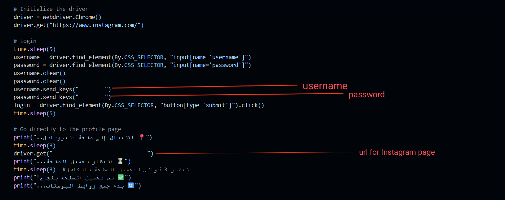

# 📸 Instagram Posts Scraper (Selenium & BeautifulSoup)

> **A robust tool for scraping and analyzing data from Instagram posts (Likes, Comments, Hashtags, Caption) using browser automation (Selenium).**

---

## 📋 Table of Contents

* [About the Project](#💡-about-the-project)
* [Key Features](#✅-key-features)
* [Getting Started](#🛠️-getting-started)
    * [Prerequisites](#prerequisites)
    * [Installation](#installation)
* [How to Run the Code](#▶️-how-to-run-the-code)
* [Extracted Data Structure](#📊-extracted-data-structure)
* [Important Warning](#⚠️-important-warning)

---

## 💡 About the Project

This project is a **Jupyter Notebook** designed to scrape detailed data from the posts of a specific Instagram profile. The tool primarily relies on the **Selenium** library to simulate user behavior and overcome the dynamic loading limitations imposed by Instagram. It also utilizes **BeautifulSoup** and **Pandas** for data parsing, analysis, and storage.


---

**The process is executed in two main steps:**
1. **Link Collection:** Logging into Instagram, then scrolling through the target profile page to collect the links of all posts (images, videos, reels).
2. **Detailed Data Collection:** Iterating through each post link to gather the publication date, media type (Image/Video), Likes count, Caption, Hashtags, and scraping comments, including attempts to scroll and load as many comments as possible.

## ✅ Key Features

* 🌐 **Comprehensive Collection:** Gathers links for all posts and Reels from any public profile after login.
* 🤖 **Smart Automation:** Uses **Selenium** to handle JavaScript execution and dynamic scrolling to load hidden content.
* 💖 **Robust Like Extraction:** Features an enhanced function (`get_likes_count`) for highly reliable extraction of Likes count, including compact formats (e.g., `1.2K`, `3M`).
* 💬 **Comment Aggregation:** Attempts to scrape the maximum number of comments per post by simulating scrolling within the comments modal.
* \#️⃣ **Caption Analysis:** Separately extracts **Hashtags** (`#hashtags`) and **Mentions** (`@mentions`) from the main caption text.
* 💾 **Data Storage:** Saves all collected data into clean and organized `CSV` files for easy analysis.

---

## 🛠️ Getting Started

Follow these steps to set up and run the project.

### Prerequisites

You must have a **Python** environment installed and be able to run a Jupyter Notebook or JupyterLab.

1.  **Python (3.x)**
2.  **Chrome Browser**
3.  **ChromeDriver:** Must be compatible with your Chrome browser version.

### Installation

1.  **Clone the repository:**
    ```bash
    git clone [https://github.com/YourUsername/YourRepoName.git](https://github.com/YourUsername/YourRepoName.git)
    cd YourRepoName
    ```
2.  **Install Required Libraries (Dependencies):**
    ```bash
    pip install pandas selenium beautifulsoup4
    ```

---

## ▶️ How to Run the Code

To start the scraping process, follow these steps in order:

1.  **Open the Notebook:** Access your **Jupyter Notebooks** environment (via the browser) and open the file:
    * `web scraping for instagram.ipynb`

2.  **Modify Login Credentials:** Go to **Cell No. 2**, which is dedicated to the login process, and replace the spaces with your actual Instagram username and password:

    ```python
    # Cell 2: Edit here
    username.send_keys("YOUR_INSTAGRAM_USERNAME_HERE") 
    password.send_keys("YOUR_INSTAGRAM_PASSWORD_HERE") 
    ```
    

    
    > ⚠️ **Note:** Ensure you check the login credentials carefully before running.

3.  **Specify the Target Profile:** In the same **Cell No. 2**, modify the target page URL:

    ```python
    # Cell 2: Edit the target profile link here
    driver.get("[https://www.instagram.com/THE_TARGET_PROFILE/](https://www.instagram.com/THE_TARGET_PROFILE/)")
    ```

4.  **Sequential Execution:** Run all notebook cells **in sequence** (Run All). The Chrome browser will launch automatically via Selenium and begin the scraping process.

---

## 📊 Extracted Data Structure

The detailed data is saved in a `CSV` file with the following columns:

| Column | Description |
| :--- | :--- |
| `Post Number` | The order of the post in the collected links list. |
| `Post Link` | The direct URL of the post. |
| `Media Type` | The type of media: (`Video` or `Image`). |
| `Post Date` | The publication date (in ISO 8601 format). |
| `Likes Count` | The number of Likes. |
| `Caption` | Extracted mentions (`@mentions`) from the caption. |
| `Hashtags` | Extracted hashtags (`#hashtags`) from the caption. |
| `Comments` | A list of collected comments, separated by `|`. |
| `Comment Count` | The total number of comments that were successfully scraped. |

---

## ⚠️ Important Warning

* **Risk of Blocking:** Scraping data may violate Instagram's Terms of Service. Use this tool responsibly and avoid scraping large volumes of data in a short time to prevent your account from being blocked.
* **Frequent Updates:** This scraping method relies on Instagram's current HTML structure. The tool might stop working if Instagram changes its class names or XPaths.
* **Use a Dedicated Account:** It is strongly recommended to use a secondary or **Dummy Instagram Account** to avoid compromising your main account.

